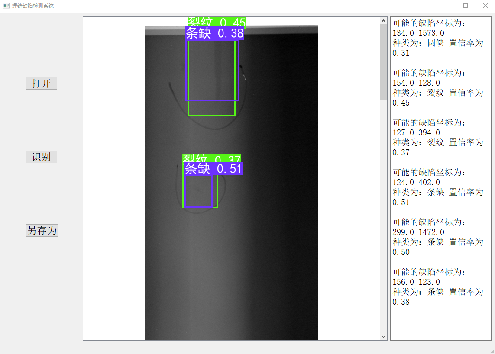

# 焊缝检测
使用YOLOV3对特检所焊缝进行检测，并制作了可视化界面。使用opencv读取训练后的.onnx文件，输出检测后的结果及缺陷坐标与类别。
## 输出检测demo

## 预训练模型

+ .onnx格式的预训练模型如下。<br>
>- 链接：https://pan.baidu.com/s/1TAUbFUjmQ_iajZCGqbfWtQ
>- 提取码：jmwz

## 使用方法
1. 将下载的预训练权重放在model_data文件夹下。
2. 运行GUI.py文件。
``` bash
python GUI.py
```
3. 点击 ”打开“ 按钮，选择待检图片。
4. 点击 ”识别“ 按钮，生成检测结果，中间容器显示检测后图片，右侧文本框显示缺陷坐标及种类与置信率。
5. 点击 ”另存为“ 按钮，存储检测结果。

## Reference
+ https://github.com/zdfb/YOLOV3
+ https://github.com/bubbliiiing/yolo3-pytorch

